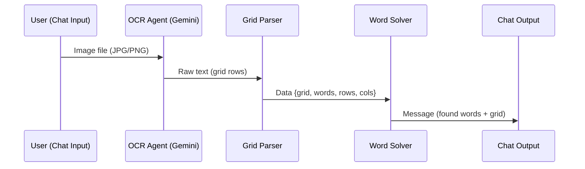

# Agent Specification Document

## Word Search Puzzle Solver — DataStax Langflow

---

## 1. System Overview

The Word Search Solver is a multi-agent system built on DataStax Langflow that processes word search puzzle images and returns solved results with highlighted words. It combines AI-powered vision (OCR) with deterministic algorithmic solving.

---

## 2. Agent Architecture

```
┌──────────────┐     ┌──────────────┐     ┌──────────────────┐     ┌────────────┐
│  Chat Input  │────▶│  OCR Agent   │────▶│   Grid Parser    │────▶│ Word Search│
│  (Image)     │     │  (Gemini)    │     │   (Custom)       │     │  Solver    │
└──────────────┘     └──────────────┘     └──────────────────┘     │  (Custom)  │
                                                                    └─────┬──────┘
                                                                          │
                                                                    ┌─────▼──────┐
                                                                    │ Chat Output│
                                                                    └────────────┘
```

---

## 3. Agent Specifications

### Agent 1: OCR Agent (Vision Model)

| Property | Detail |
|----------|--------|
| **Type** | Built-in Langflow Agent Component |
| **Model Provider** | Google Generative AI |
| **Model** | `gemini-2.0-flash-001` (fallback: `gemini-flash-lite-latest`) |
| **Role** | Extract letter grid from puzzle image via OCR |
| **Input** | Image file (JPG/PNG) from Chat Input |
| **Output** | Raw text — each row of letters on a new line, space-separated |
| **Autonomy** | Fully autonomous — no human-in-the-loop |

#### Agent Prompt
```
You are an OCR expert. Extract ONLY the letter grid from this word search
puzzle image. Output each row on its own line, letters separated by single
spaces, ALL UPPERCASE. No extra text, no headers, no explanations.
```

#### Capabilities
- Image understanding and text extraction
- Handles varied image quality (photos, scans)
- Filters out non-grid elements (decorations, titles)

#### Limitations
- Accuracy depends on image clarity
- May miss columns if grid is partially obscured
- Subject to API rate limits (15 RPM free tier)

---

### Agent 2: Grid Parser (Custom Component)

| Property | Detail |
|----------|--------|
| **Type** | Custom Langflow Component (`grid_parser.py`) |
| **Role** | Parse raw OCR text into structured 2D grid data |
| **Input** | Raw text string from OCR Agent |
| **Output** | `Data` object containing `grid`, `rows`, `cols`, `words` |
| **Autonomy** | Deterministic — no AI/LLM calls |

#### Processing Logic
1. Splits raw text by newlines
2. For each line, extracts alphabetic characters
3. Handles both space-separated and continuous letter formats
4. Converts all letters to uppercase
5. Parses the configurable word list (comma-separated)

#### Input/Output Schema

**Input:**
```
MessageTextInput: raw_grid_text (string)
MessageTextInput: words_to_find (string, comma-separated)
```

**Output:**
```json
{
  "grid": [["K","J","C","Q",...], ["C","T","N","D",...], ...],
  "rows": 17,
  "cols": 20,
  "words": ["IRONMAN", "THOR", "HULK", ...]
}
```

---

### Agent 3: Word Search Solver (Custom Component)

| Property | Detail |
|----------|--------|
| **Type** | Custom Langflow Component (`word_search_solver.py`) |
| **Role** | Find all target words in the grid using algorithmic search |
| **Input** | `Data` object from Grid Parser |
| **Output** | `Message` with found words, positions, directions, and colors |
| **Autonomy** | Deterministic — no AI/LLM calls |

#### Algorithm
- **Search strategy**: Brute-force scan of all cells × all 8 directions
- **Directions**: → ← ↓ ↑ ↘ ↙ ↗ ↖
- **Complexity**: O(R × C × D × W × L) where R=rows, C=cols, D=8 directions, W=words, L=word length
- **Color assignment**: 20-color palette, cyclically assigned per word

#### Search Directions

| Symbol | Direction | Delta (dr, dc) |
|--------|-----------|-----------------|
| → | Right | (0, +1) |
| ← | Left | (0, -1) |
| ↓ | Down | (+1, 0) |
| ↑ | Up | (-1, 0) |
| ↘ | Down-Right | (+1, +1) |
| ↙ | Down-Left | (+1, -1) |
| ↗ | Up-Right | (-1, +1) |
| ↖ | Up-Left | (-1, -1) |

#### Output Format
```
GRID (17x20):
  K J C Q U G M S C T T H B G K S L E B P
  C T N D V I E S R F S T U Y L J G I O M
  ...

FOUND 6 of 28 WORDS:
  THOR dir:↓ color:#f39c12 cells:[[0,9],[1,9],[2,9],[3,9]]
  HULK dir:↘ color:#2ecc71 cells:[[2,3],[3,4],[4,5],[5,6]]
  ...

NOT FOUND: IRONMAN, THANOS, VISION, ...
```

---

## 4. Inter-Agent Communication



| Connection | Data Type | Description |
|------------|-----------|-------------|
| Chat Input → OCR Agent | Image (binary) | Raw puzzle image |
| OCR Agent → Grid Parser | Message (text) | Extracted grid as plain text |
| Grid Parser → Word Solver | Data (structured) | 2D grid array + word list |
| Word Solver → Chat Output | Message (text/HTML) | Solved results with highlighting |

---

## 5. Technology Stack

| Component | Technology | Purpose |
|-----------|-----------|---------|
| **Orchestration** | DataStax Langflow | Visual flow builder, agent orchestration |
| **Vision/OCR** | Google Gemini 2.0 Flash | Image-to-text extraction |
| **Grid Parsing** | Python (Custom Component) | Text structuring |
| **Word Search** | Python (Custom Component) | Algorithmic word finding |
| **UI** | Langflow Playground | Chat-based interaction |

---

## 6. API Dependencies

| API | Provider | Model | Free Tier |
|-----|----------|-------|-----------|
| Google Generative AI | Google | `gemini-2.0-flash-001` | 15 RPM, 1M tokens/min |
| Groq (optional) | Groq | `llama-3.3-70b-versatile` | 30 RPM |

### Environment Variables
```
GOOGLE_API_KEY=<your-google-api-key>
GROQ_API_KEY=<your-groq-api-key>
```

---

## 7. Error Handling

| Scenario | Agent | Handling |
|----------|-------|----------|
| Empty image | OCR Agent | Returns empty text, Grid Parser produces empty grid |
| OCR failure | OCR Agent | Grid Parser receives malformed text, outputs partial grid |
| Empty grid | Word Solver | Returns `"ERROR: Empty grid received"` |
| Unequal row lengths | Word Solver | Handles dynamically with `len(grid[nr])` per-row bounds |
| API rate limit | OCR Agent | Returns 429 error — user must wait or switch key |
| Word not found | Word Solver | Added to `NOT FOUND` list in output |

---

## 8. Design Decisions

1. **Deterministic solving over LLM-based**: The word search algorithm is implemented in Python rather than asking an LLM to solve it. This ensures 100% accuracy for found words — LLMs hallucinate grid positions.

2. **Custom Components over built-in**: Grid parsing and word searching require exact logic that LLMs cannot reliably provide. Custom Langflow components give full control.

3. **Separation of concerns**: OCR (AI) → Parsing (deterministic) → Solving (deterministic). Each step has a clear, testable responsibility.

4. **Per-row bounds checking**: Instead of assuming a uniform grid size, the solver checks each row's actual length. This handles OCR output where some rows may have fewer letters.
