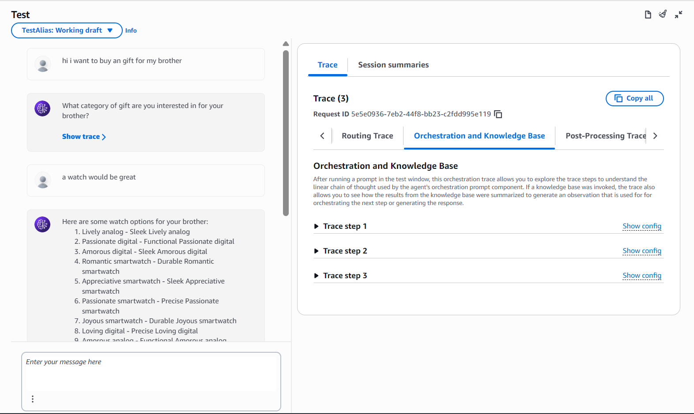
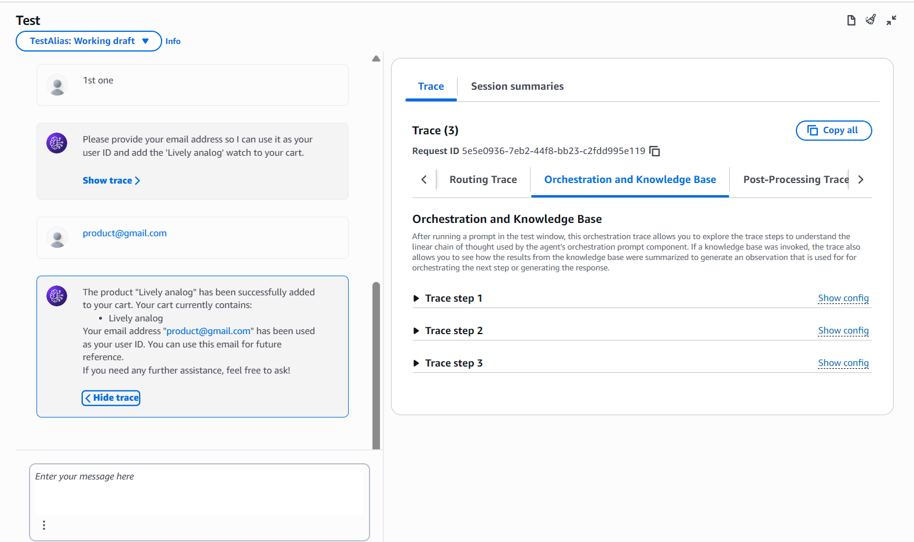
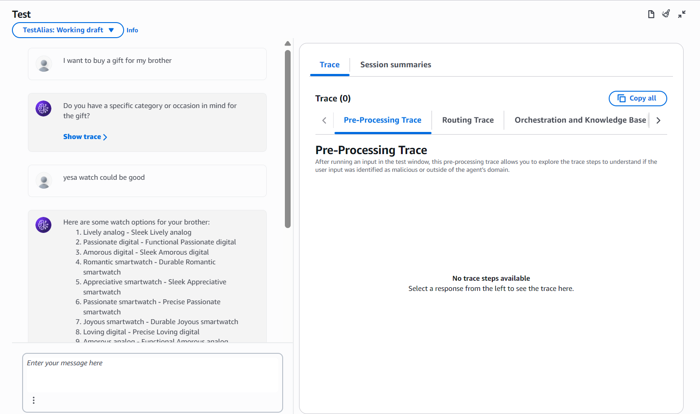
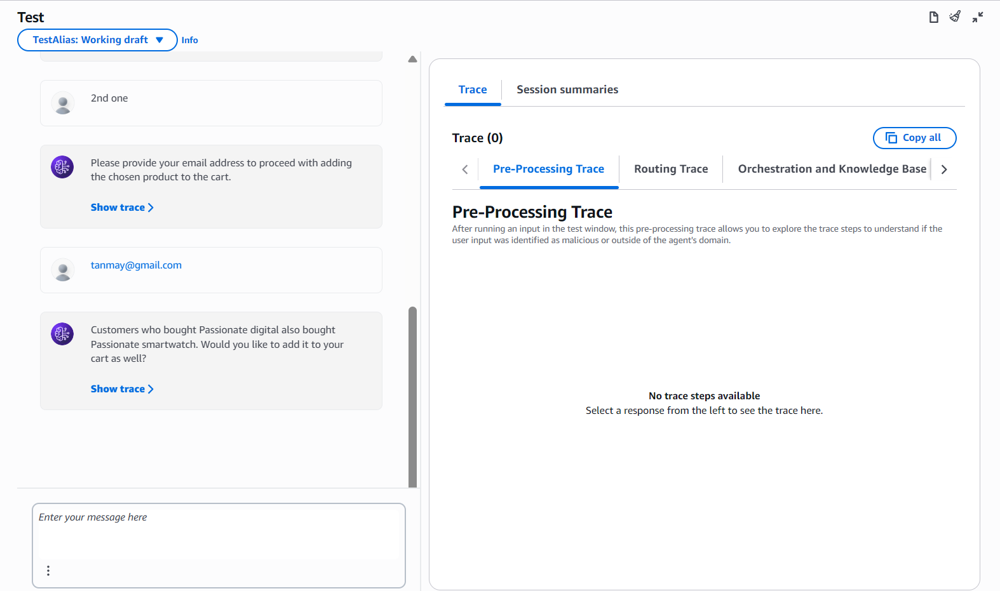
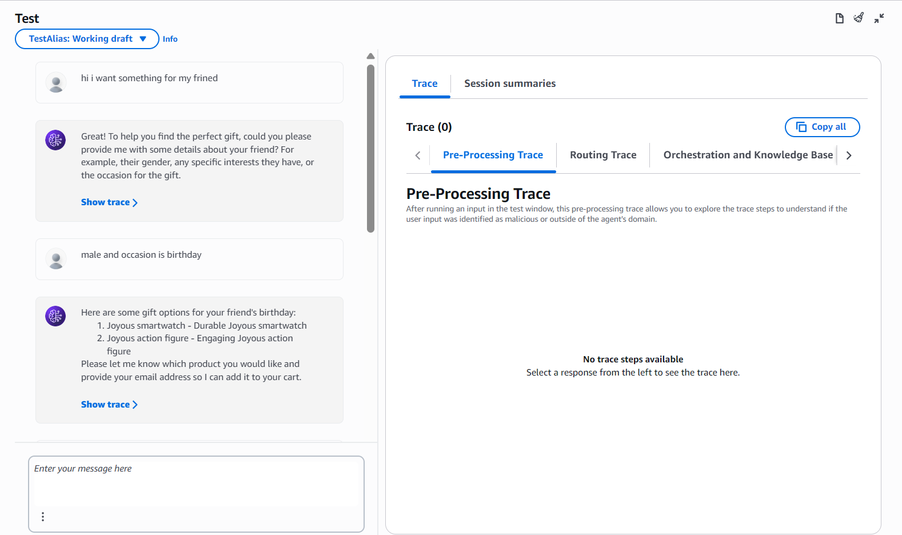
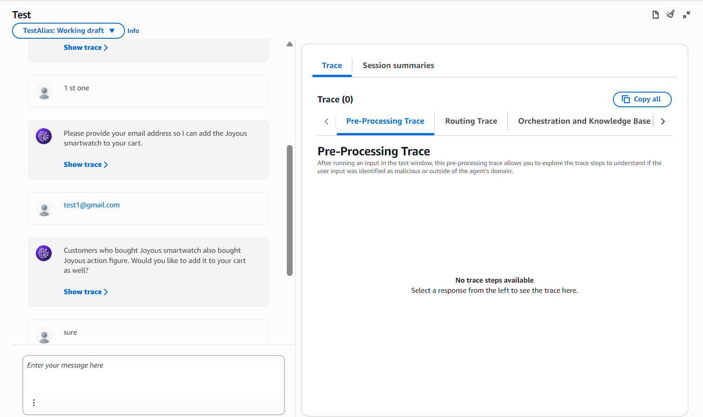
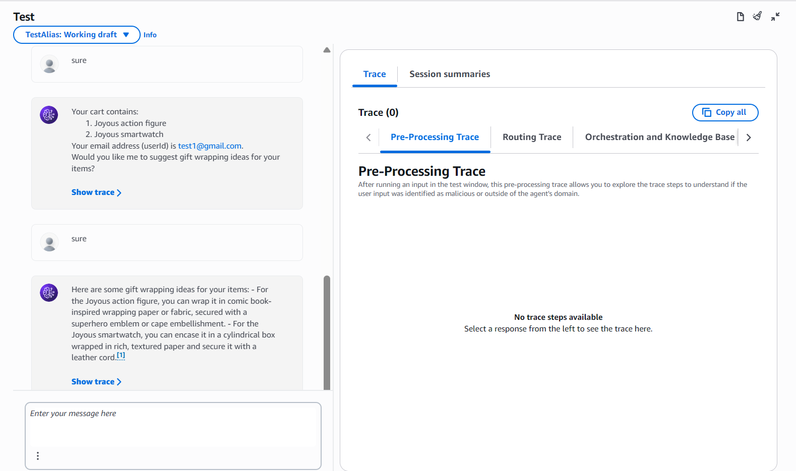
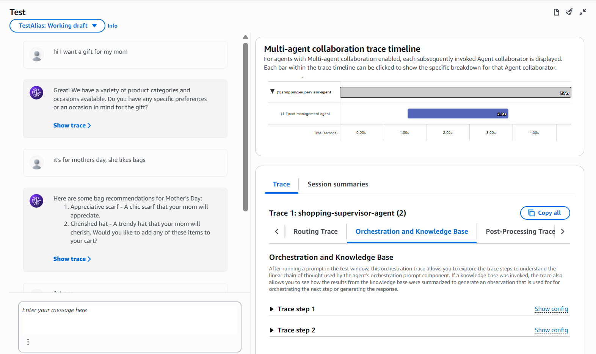
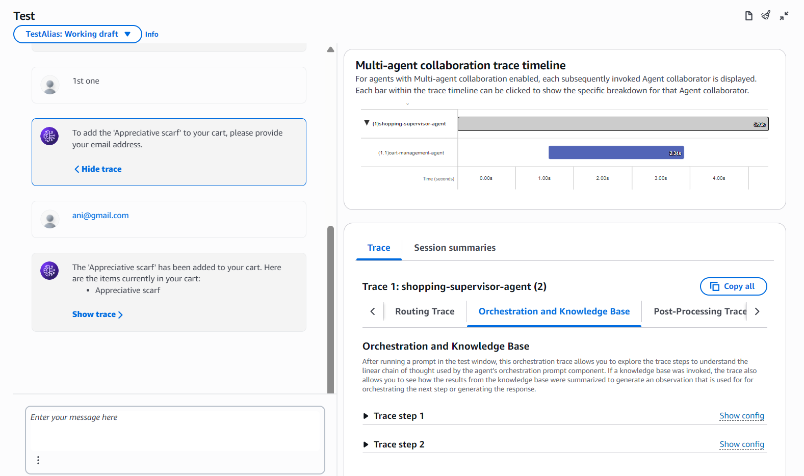

### AWS Bedrock Agent Workshop

A conversational AI shopping assistant built on Amazon Bedrock Agents that helps users find gifts, manage a cart, get personalized recommendations, and receive gift wrapping ideas.
**Workshop URL:** https://catalog.us-east-1.prod.workshops.aws/workshops/7ca892c2-91a4-47a7-a675-22c9e85b5e18/en-US/
---

### Architecture

```
User
 └── Bedrock Agent
       ├── Product Recommendations  →  GetProductDetailsFunction (Lambda)  →  DynamoDB
       ├── Add to Cart              →  AddToCartFunction (Lambda)           →  DynamoDB
       ├── Get Cart                 →  GetCartFunction (Lambda)             →  DynamoDB
       ├── Amazon Personalize       →  GetPersonalizeRecommendationFunction (Lambda)
       └── Gift Wrapping KB         →  S3 (Gift-wrapping.txt)              →  Vector Store
```

---

## Part 1 — Basic Agent + Cart

Set up the Bedrock Agent with product recommendation and cart action groups backed by Lambda and DynamoDB.

**Key fix:** Advanced Prompts → set `Max output tokens` to `8192` and enable override.

**Result:** Agent successfully adds products to cart and displays contents.




---

## Part 2 — Amazon Personalize Integration

Added a simulated "Customers who also bought" recommendation after every cart addition using `GetPersonalizeRecommendationFunction`.

**Result:** After adding an item, agent suggests a related product.




---

## Part 3 — Gift Wrapping Knowledge Base

Created a Bedrock Knowledge Base from `Gift-wrapping.txt` stored in S3 with a vector store. Agent searches KB at end of conversation to suggest wrapping ideas.

**Result:** Agent proactively offers gift wrapping suggestions based on cart items.





---

## Part 4 — Multi-Agent Collaboration

Split into three agents — a supervisor coordinating two specialized sub-agents:

| Agent | Role |
|-------|------|
| `shopping-supervisor-agent` | Supervisor — coordinates the flow |
| `product-details-agent` | Handles product search and recommendations |
| `cart-management-agent` | Handles cart operations |

**Multi-Agent Collaboration**



