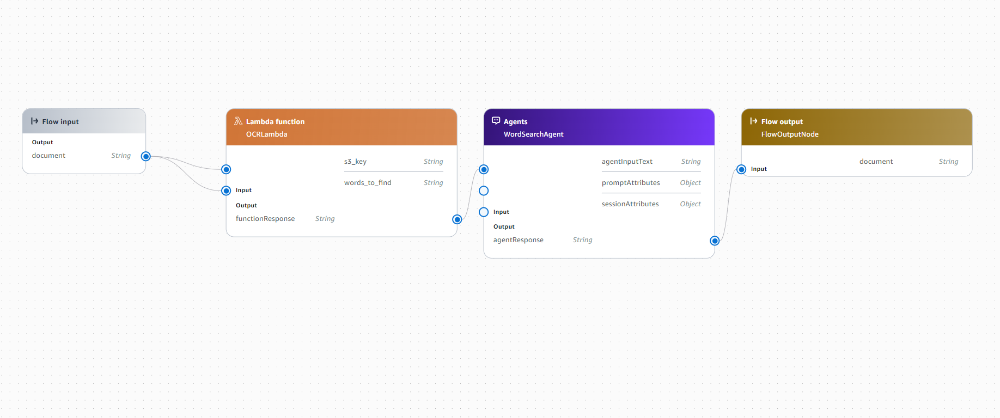
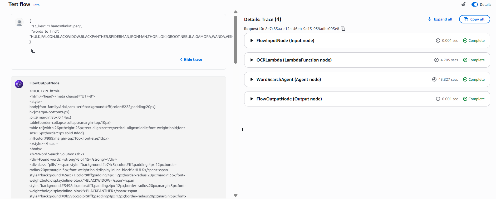
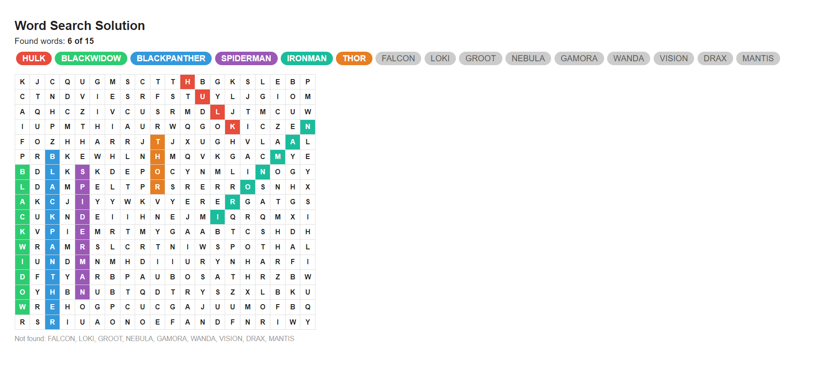

# 🧩 Word Search Puzzle Solver — AWS Bedrock Flow

> Automatically solves Marvel-themed word search puzzles using AWS Bedrock Flows, Nova Pro OCR, and a Bedrock Agent.

---

## Architecture

```
Flow Input (s3_key + words_to_find)
        ↓
  OCRLambda  ←── Amazon Nova Pro (vision OCR)
        ↓
 WordSearchAgent ←── Bedrock Agent + solve_word_search tool
        ↓
  Flow Output (styled HTML)
```

The Bedrock Flow chains together:
1. **OCRLambda** — reads the puzzle image from S3, uses Nova Pro to extract the full letter grid row by row
2. **WordSearchAgent** — Bedrock Agent that calls the `solve_word_search` action group to find words in the grid and generate styled HTML output

---


## Screenshots

### Bedrock Flow


---

### Execution Trace
All 4 nodes completing end-to-end:



---

### Output
Found **6 of 15** Marvel Avengers words highlighted in color:



---

## ⚙️ AWS Setup

- **S3 Bucket**: `word-search-puzzles` — upload puzzle images here
- **Lambda**: `word-search-ocr` and `word-search-solver` (both us-east-1)
- **Bedrock Agent**: `WordSearchAgent` with action group `SolvePuzzle`
- **Bedrock Flow**: connects OCRLambda → WordSearchAgent → output

### Environment Variables (OCR Lambda)
| Variable | Value |
|----------|-------|
| `S3_BUCKET_NAME` | `word-search-puzzles` |

---

## 🔑 IAM Permissions Required

- `bedrock:InvokeModel` (Nova Pro)
- `s3:GetObject` on the puzzle bucket
- `bedrock:InvokeAgent` (WordSearchAgent)


---

## ✅ Words Found (sample run)

**Found 6 of 15:** HULK · BLACKWIDOW · BLACKPANTHER · SPIDERMAN · IRONMAN · THOR

---

## ⚙️ AWS Setup

- **S3 Bucket**: `word-search-puzzles` — upload puzzle images here
- **Lambda**: `word-search-ocr` and `word-search-solver` (both us-east-1)
- **Bedrock Agent**: `WordSearchAgent` with action group `SolvePuzzle`
- **Bedrock Flow**: connects OCRLambda → WordSearchAgent → output

### Environment Variables (OCR Lambda)
| Variable | Value |
|----------|-------|
| `S3_BUCKET_NAME` | `word-search-puzzles` |

---

## 🔑 IAM Permissions Required

- `bedrock:InvokeModel` (Nova Pro)
- `s3:GetObject` on the puzzle bucket
- `bedrock:InvokeAgent` (WordSearchAgent)
